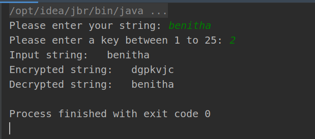
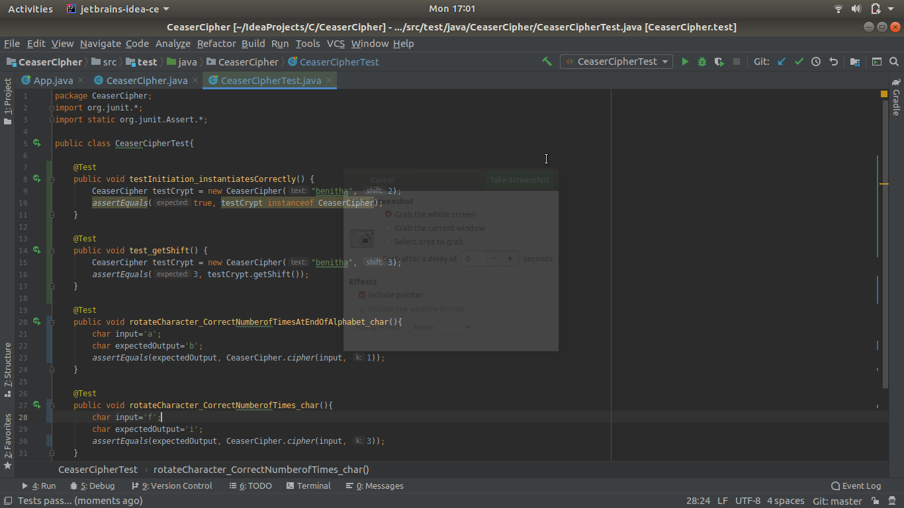
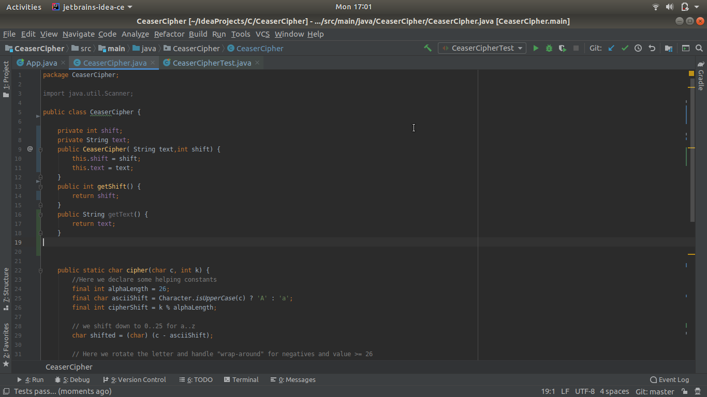
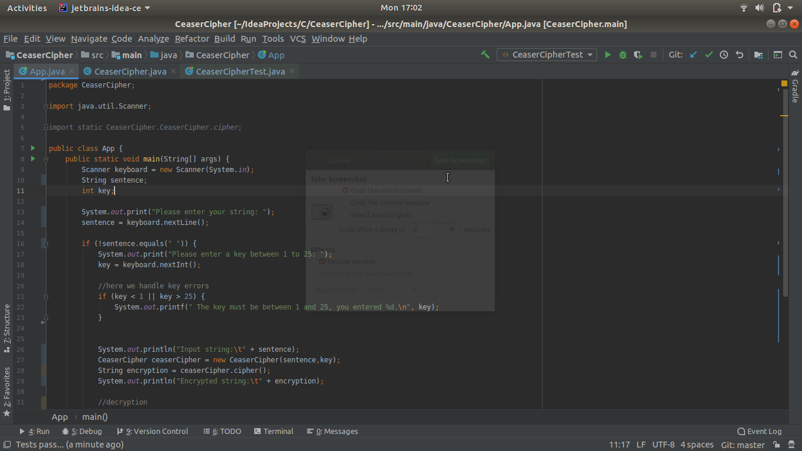

# Caesar Cipher
This is an encryption program that takes in text input from a user and encrypts the inputed text . It only encrypts letters with the user providing the encryption key which must be between numbers 1-26. 

## Author
* Benitha Uwase

## Project Setup Instructions
Follow the following setup instructions to run the program.
* Install the java software development kit (sdk)
* Install java
* Install gradle
* To run the program in the terminal you can use 'gradle run' command

## Technologies Used
* Intelli J IDEA
* java
* Git

## Picture

Copyright (c) 2020 [MIT LICENSE](./LICENSE)

